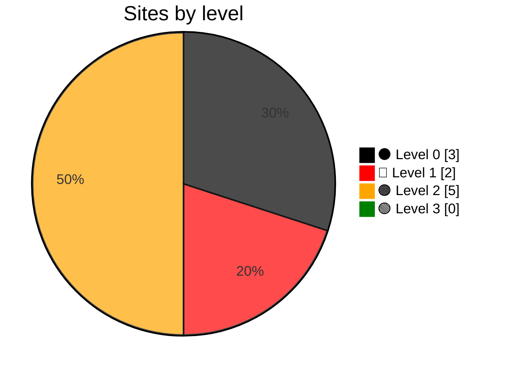

# Grading Government Websites (`glwa`)

  

`glwa` audits Sri Lankan government websites using an evidence-based, cumulative grading model. It records reproducible evidence for each level and publishes the latest classification and audit report for every website in Sri Lanka. 🇱🇰

> **Implementation status:** Only `⚫ Level 0`, `🔴 Level 1`, `🟠 Level 2`, and `🟢 Level 3` are implemented.

## Levels and scoring

| Level | Implemented | Description |
| --- | :---: | --- |
| `⚫ Level 0` | ✅ Yes | A site is classified as `⚫ Level 0` when it is unavailable or unusable, or when there is not enough evidence to establish that it meets `🔴 Level 1`. |
| `🔴 Level 1` | ✅ Yes | The website must be available, usable, and clearly associated with the government institution. It must load reliably with valid DNS, HTTP, and TLS behavior. |
| `🟠 Level 2` | ✅ Yes | Citizens must be able to identify and contact the correct office for the service they need. |
| `🟢 Level 3` | ✅ Yes | Citizens must find complete and current instructions, requirements, fees, times, and usable forms. |
| `🔵 Level 4` | ❌ No | Citizens must be able to complete, pay for, track, and receive the outcome of a service online. |
| `🟣 Level 5` | ❌ No | Services must be connected across agencies, proactive for eligible citizens, explainable, and accountable. |

The score is out of 3. `🔴 Level 1` through `🟢 Level 3` each contribute up to 1 point, calculated as passing checks divided by total checks. `⚫ Level 0` contributes no points. The total is shown to one decimal place.

## Sites by level

## Documentation

- [Article](docs/article.md): The grading framework.
- [Design](docs/design.md): Architecture and rules.
- [Roadmap](docs/roadmap.md): Work completed and planned.

## `⚫ Level 0`

**3 URLs at `⚫ Level 0`.**

Checks used: Availability and usability checks.

| Score | URL |
| ---: | --- |
| 0.3/3 | [https://aib.gov.lk/aib/](latest_audit_reports/aib.gov.lk/audit.md) |
| 0.3/3 | [https://dea.gov.lk/](latest_audit_reports/dea.gov.lk/audit.md) |
| 0.7/3 | [http://www.landsettledept.gov.lk/](latest_audit_reports/www.landsettledept.gov.lk/audit.md) |

## `🔴 Level 1`

**2 URLs at `🔴 Level 1`.**

Checks used: DNS resolves, Domain not parked, Site not defaced, Content relevant, Hosting configured, HTTP available, Redirect related, TLS browser trusted, TLS not expired, TLS hostname matches.

| Score | URL |
| ---: | --- |
| 1.7/3 | [https://landcom.gov.lk/](latest_audit_reports/landcom.gov.lk/audit.md) |
| 1.7/3 | [https://www.agrarian.lk/](latest_audit_reports/www.agrarian.lk/audit.md) |

## `🟠 Level 2`

**5 URLs at `🟠 Level 2`.**

Checks used: Postal address, Reachable contacts, Named responsibility.

| Score | URL |
| ---: | --- |
| 2.1/3 | [https://daph.gov.lk/](latest_audit_reports/daph.gov.lk/audit.md) |
| 2.1/3 | [https://doa.gov.lk/](latest_audit_reports/doa.gov.lk/audit.md) |
| 2.1/3 | [https://www.cecb.lk/](latest_audit_reports/www.cecb.lk/audit.md) |
| 2.3/3 | [https://cinnamon.gov.lk/](latest_audit_reports/cinnamon.gov.lk/audit.md) |
| 2.4/3 | [https://www.irrigation.gov.lk/](latest_audit_reports/www.irrigation.gov.lk/audit.md) |

## `🟢 Level 3`

**0 URLs at `🟢 Level 3`.**

Checks used: Eligibility criteria, Required documents, Fees and payment, Legal basis, Processing time, Downloadable form, Published update date.
