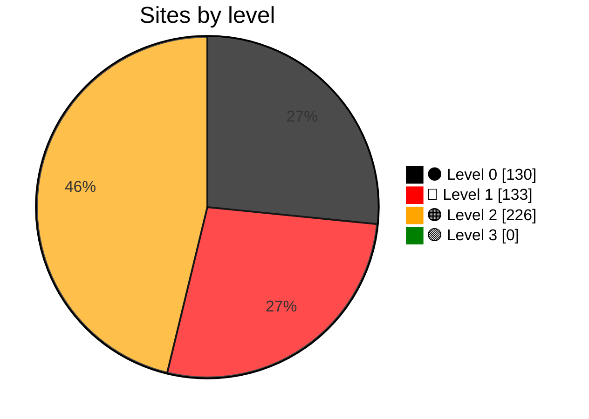

# Grading Government Websites (`glwa`)

   

`glwa` audits Sri Lankan government websites using an evidence-based, cumulative grading model. It records reproducible evidence for each level and publishes the latest classification and audit report for every website in Sri Lanka. 🇱🇰

> **Implementation status:** Only `⚫ Level 0`, `🔴 Level 1`, `🟠 Level 2`, and `🟢 Level 3` are implemented.

## Levels and scoring

| Level | Implemented | Description |
| --- | :---: | --- |
| `⚫ Level 0` | ✅ Yes | A site is classified as `⚫ Level 0` when it is unavailable or unusable, or when there is not enough evidence to establish that it meets `🔴 Level 1`. |
| `🔴 Level 1` | ✅ Yes | The website must be available, usable, and clearly associated with the government institution. It must load reliably with valid DNS, HTTP, and TLS behavior. |
| `🟠 Level 2` | ✅ Yes | Citizens must be able to identify and contact the correct office for the service they need. |
| `🟢 Level 3` | ✅ Yes | Citizens must find complete and current instructions, requirements, fees, times, and usable forms. |
| `🔵 Level 4` | ❌ No | Citizens must be able to complete, pay for, track, and receive the outcome of a service online. |
| `🟣 Level 5` | ❌ No | Services must be connected across agencies, proactive for eligible citizens, explainable, and accountable. |

The score is out of 3. `🔴 Level 1` through `🟢 Level 3` each contribute up to 1 point, calculated as passing checks divided by total checks. `⚫ Level 0` contributes no points. The total is shown to one decimal place.

## Sites by level

## Documentation

- [Article](docs/article.md): The grading framework.
- [Design](docs/design.md): Architecture and rules.
- [Roadmap](docs/roadmap.md): Work completed and planned.

## `⚫ Level 0`

**130 URLs at `⚫ Level 0`.**

Checks used: Availability and usability checks.

| Score | URL |
| ---: | --- |
| 0.0/3 | [http://www.ancoe.sch.lk/](latest_audit_reports/www.ancoe.sch.lk/audit.md) |
| 0.0/3 | [http://www.skillsdevelop.lk/](latest_audit_reports/www.skillsdevelop.lk/audit.md) |
| 0.0/3 | [http://www.slmti.lk/](latest_audit_reports/www.slmti.lk/audit.md) |
| 0.0/3 | [https://jaffnancoe.lk/](latest_audit_reports/jaffnancoe.lk/audit.md) |
| 0.0/3 | [https://sugarres.lk/](latest_audit_reports/sugarres.lk/audit.md) |
| 0.0/3 | [https://www.delimitation.gov.lk/](latest_audit_reports/www.delimitation.gov.lk/audit.md) |
| 0.0/3 | [https://www.nproccom.gov.lk/](latest_audit_reports/www.nproccom.gov.lk/audit.md) |
| 0.0/3 | [https://www.sema.gov.lk/](latest_audit_reports/www.sema.gov.lk/audit.md) |
| 0.1/3 | [http://textiledept.gov.lk/](latest_audit_reports/textiledept.gov.lk/audit.md) |
| 0.1/3 | [http://www.cmb.ac.lk/](latest_audit_reports/www.cmb.ac.lk/audit.md) |
| 0.1/3 | [http://www.sab.ac.lk/](latest_audit_reports/www.sab.ac.lk/audit.md) |
| 0.1/3 | [http://www.vpa.ac.lk/](latest_audit_reports/www.vpa.ac.lk/audit.md) |
| 0.1/3 | [https://cgf.gov.lk/](latest_audit_reports/cgf.gov.lk/audit.md) |
| 0.1/3 | [https://data.gov.lk/](latest_audit_reports/data.gov.lk/audit.md) |
| 0.1/3 | [https://forms.gov.lk/welcome/public](latest_audit_reports/forms.gov.lk/audit.md) |
| 0.1/3 | [https://itmd.treasury.gov.lk/](latest_audit_reports/itmd.treasury.gov.lk/audit.md) |
| 0.1/3 | [https://npd.treasury.gov.lk/](latest_audit_reports/npd.treasury.gov.lk/audit.md) |
| 0.1/3 | [https://nppd.gov.lk/](latest_audit_reports/nppd.gov.lk/audit.md) |
| 0.1/3 | [https://pensions.gov.lk/](latest_audit_reports/pensions.gov.lk/audit.md) |
| 0.1/3 | [https://ranmihithanna.gov.lk/](latest_audit_reports/ranmihithanna.gov.lk/audit.md) |
| 0.1/3 | [https://www.energymin.gov.lk/](latest_audit_reports/www.energymin.gov.lk/audit.md) |
| 0.1/3 | [https://www.inss.lk/](latest_audit_reports/www.inss.lk/audit.md) |
| 0.1/3 | [https://www.jsc.gov.lk/](latest_audit_reports/www.jsc.gov.lk/audit.md) |
| 0.1/3 | [https://www.ncisl.health.gov.lk/](latest_audit_reports/www.ncisl.health.gov.lk/audit.md) |
| 0.1/3 | [https://www.niss.gov.lk/](latest_audit_reports/www.niss.gov.lk/audit.md) |
| 0.1/3 | [https://www.planetarium.gov.lk/](latest_audit_reports/www.planetarium.gov.lk/audit.md) |
| 0.1/3 | [https://www.powermin.gov.lk/](latest_audit_reports/www.powermin.gov.lk/audit.md) |
| 0.1/3 | [https://www.probation.gov.lk/](latest_audit_reports/www.probation.gov.lk/audit.md) |
| 0.2/3 | [http://ncld.gov.lk/](latest_audit_reports/ncld.gov.lk/audit.md) |
| 0.2/3 | [http://www.luppd.gov.lk/](latest_audit_reports/www.luppd.gov.lk/audit.md) |
| 0.2/3 | [https://pmb.gov.lk/](latest_audit_reports/pmb.gov.lk/audit.md) |
| 0.3/3 | [http://cpl.gov.lk/](latest_audit_reports/cpl.gov.lk/audit.md) |
| 0.3/3 | [http://govtfactory.gov.lk/](latest_audit_reports/govtfactory.gov.lk/audit.md) |
| 0.3/3 | [http://tshda.lk/](latest_audit_reports/tshda.lk/audit.md) |
| 0.3/3 | [http://www.lankasathosa.org/](latest_audit_reports/www.lankasathosa.org/audit.md) |
| 0.3/3 | [http://www.ndrsc.gov.lk/](latest_audit_reports/www.ndrsc.gov.lk/audit.md) |
| 0.3/3 | [http://www.portmin.gov.lk/](latest_audit_reports/www.portmin.gov.lk/audit.md) |
| 0.3/3 | [http://www.ruh.ac.lk/](latest_audit_reports/www.ruh.ac.lk/audit.md) |
| 0.3/3 | [https://aib.gov.lk/aib/](latest_audit_reports/aib.gov.lk/audit.md) |
| 0.3/3 | [https://dea.gov.lk/](latest_audit_reports/dea.gov.lk/audit.md) |
| 0.3/3 | [https://kdb.gov.lk/](latest_audit_reports/kdb.gov.lk/audit.md) |
| 0.3/3 | [https://laksalasl.weebly.com/](latest_audit_reports/laksalasl.weebly.com/audit.md) |
| 0.3/3 | [https://mpc.kdu.ac.lk/](latest_audit_reports/mpc.kdu.ac.lk/audit.md) |
| 0.3/3 | [https://olc.gov.lk/](latest_audit_reports/olc.gov.lk/audit.md) |
| 0.3/3 | [https://ovdc.lk/](latest_audit_reports/ovdc.lk/audit.md) |
| 0.3/3 | [https://sladc.lk/](latest_audit_reports/sladc.lk/audit.md) |
| 0.3/3 | [https://slnc.lk/](latest_audit_reports/slnc.lk/audit.md) |
| 0.3/3 | [https://thjaffna.lk/](latest_audit_reports/thjaffna.lk/audit.md) |
| 0.3/3 | [https://vncoe.edu.lk/](latest_audit_reports/vncoe.edu.lk/audit.md) |
| 0.3/3 | [https://www.auditorgeneral.gov.lk/](latest_audit_reports/www.auditorgeneral.gov.lk/audit.md) |
| 0.3/3 | [https://www.caa.lk/](latest_audit_reports/www.caa.lk/audit.md) |
| 0.3/3 | [https://www.erd.gov.lk/](latest_audit_reports/www.erd.gov.lk/audit.md) |
| 0.3/3 | [https://www.fcd.gov.lk/](latest_audit_reports/www.fcd.gov.lk/audit.md) |
| 0.3/3 | [https://www.icta.lk/](latest_audit_reports/www.icta.lk/audit.md) |
| 0.3/3 | [https://www.ism.gov.lk/](latest_audit_reports/unknown/audit.md) |
| 0.3/3 | [https://www.jedb.lk/](latest_audit_reports/www.jedb.lk/audit.md) |
| 0.3/3 | [https://www.ocds.lk/](latest_audit_reports/www.ocds.lk/audit.md) |
| 0.3/3 | [https://www.pedmis.gov.lk/](latest_audit_reports/www.pedmis.gov.lk/audit.md) |
| 0.3/3 | [https://www.supremecourt.lk/](latest_audit_reports/www.supremecourt.lk/audit.md) |
| 0.5/3 | [https://artscouncil.lk/](latest_audit_reports/artscouncil.lk/audit.md) |
| 0.6/3 | [http://edupub.gov.lk/](latest_audit_reports/edupub.gov.lk/audit.md) |
| 0.6/3 | [http://pgihs.ac.lk/](latest_audit_reports/pgihs.ac.lk/audit.md) |
| 0.6/3 | [http://www.mgncoe.sch.lk/](latest_audit_reports/www.mgncoe.sch.lk/audit.md) |
| 0.6/3 | [https://cda.gov.lk/](latest_audit_reports/cda.gov.lk/audit.md) |
| 0.6/3 | [https://condominium.lk/](latest_audit_reports/condominium.lk/audit.md) |
| 0.6/3 | [https://coop.gov.lk/](latest_audit_reports/coop.gov.lk/audit.md) |
| 0.6/3 | [https://dambulladec.com/](latest_audit_reports/dambulladec.com/audit.md) |
| 0.6/3 | [https://documents.gov.lk/](latest_audit_reports/documents.gov.lk/audit.md) |
| 0.6/3 | [https://dscsc.lk/](latest_audit_reports/dscsc.lk/audit.md) |
| 0.6/3 | [https://ircsl.gov.lk/](latest_audit_reports/ircsl.gov.lk/audit.md) |
| 0.6/3 | [https://mncoe.sch.lk/index.htm](latest_audit_reports/mncoe.sch.lk/audit.md) |
| 0.6/3 | [https://omp.gov.lk/](latest_audit_reports/omp.gov.lk/audit.md) |
| 0.6/3 | [https://sltb.lk/](latest_audit_reports/sltb.lk/audit.md) |
| 0.6/3 | [https://web.erl2.gov.lk/](latest_audit_reports/web.erl2.gov.lk/audit.md) |
| 0.6/3 | [https://www.cida.gov.lk/](latest_audit_reports/www.cida.gov.lk/audit.md) |
| 0.6/3 | [https://www.doenets.lk/](latest_audit_reports/www.doenets.lk/audit.md) |
| 0.6/3 | [https://www.fisheriesdept.gov.lk/](latest_audit_reports/www.fisheriesdept.gov.lk/audit.md) |
| 0.6/3 | [https://www.leco.lk/](latest_audit_reports/www.leco.lk/audit.md) |
| 0.6/3 | [https://www.mode.gov.lk/](latest_audit_reports/www.mode.gov.lk/audit.md) |
| 0.6/3 | [https://www.neh.health.gov.lk/](latest_audit_reports/www.neh.health.gov.lk/audit.md) |
| 0.6/3 | [https://www.nlb.lk/](latest_audit_reports/www.nlb.lk/audit.md) |
| 0.6/3 | [https://www.northsea.lk/](latest_audit_reports/www.northsea.lk/audit.md) |
| 0.6/3 | [https://www.nsf.gov.lk/](latest_audit_reports/www.nsf.gov.lk/audit.md) |
| 0.6/3 | [https://www.nvq.gov.lk/](latest_audit_reports/www.nvq.gov.lk/audit.md) |
| 0.6/3 | [https://www.psptf.lk/](latest_audit_reports/www.psptf.lk/audit.md) |
| 0.6/3 | [https://www.rdb.gov.lk/](latest_audit_reports/www.rdb.gov.lk/audit.md) |
| 0.6/3 | [https://www.rrisl.gov.lk/](latest_audit_reports/www.rrisl.gov.lk/audit.md) |
| 0.6/3 | [https://www.services.nfmis.nfs.gov.lk/](latest_audit_reports/www.services.nfmis.nfs.gov.lk/audit.md) |
| 0.6/3 | [https://www.slita.lk/](latest_audit_reports/www.slita.lk/audit.md) |
| 0.6/3 | [https://www.slsbank.lk/](latest_audit_reports/www.slsbank.lk/audit.md) |
| 0.6/3 | [https://www.svf.gov.lk/](latest_audit_reports/www.svf.gov.lk/audit.md) |
| 0.6/3 | [https://www.trc.gov.lk/](latest_audit_reports/www.trc.gov.lk/audit.md) |
| 0.7/3 | [http://dambasncoe.sch.lk/](latest_audit_reports/dambasncoe.sch.lk/audit.md) |
| 0.7/3 | [http://nacwc.gov.lk/](latest_audit_reports/nacwc.gov.lk/audit.md) |
| 0.7/3 | [http://nncoe.sch.lk/](latest_audit_reports/nncoe.sch.lk/audit.md) |
| 0.7/3 | [http://siyanencoe.sch.lk/](latest_audit_reports/siyanencoe.sch.lk/audit.md) |
| 0.7/3 | [http://spclanka.gov.lk/](latest_audit_reports/spclanka.gov.lk/audit.md) |
| 0.7/3 | [http://www.dgshipping.gov.lk/](latest_audit_reports/www.dgshipping.gov.lk/audit.md) |
| 0.7/3 | [http://www.hindudept.gov.lk/](latest_audit_reports/www.hindudept.gov.lk/audit.md) |
| 0.7/3 | [http://www.irrigationmin.gov.lk/](latest_audit_reports/www.irrigationmin.gov.lk/audit.md) |
| 0.7/3 | [http://www.landsettledept.gov.lk/](latest_audit_reports/www.landsettledept.gov.lk/audit.md) |
| 0.7/3 | [http://www.nara.ac.lk/](latest_audit_reports/www.nara.ac.lk/audit.md) |
| 0.7/3 | [http://www.ndc.ac.lk/](latest_audit_reports/www.ndc.ac.lk/audit.md) |
| 0.7/3 | [http://www.nhsl.health.gov.lk/](latest_audit_reports/www.nhsl.health.gov.lk/audit.md) |
| 0.7/3 | [http://www.prisons.gov.lk/](latest_audit_reports/www.prisons.gov.lk/audit.md) |
| 0.7/3 | [http://www.timco.lk/](latest_audit_reports/www.timco.lk/audit.md) |
| 0.7/3 | [https://www.moys.gov.lk/](latest_audit_reports/www.moys.gov.lk/audit.md) |
| 0.7/3 | [https://www.nelumpokuna.com/](latest_audit_reports/www.nelumpokuna.com/audit.md) |
| 0.7/3 | [https://www.rncoe.lk/](latest_audit_reports/www.rncoe.lk/audit.md) |
| 0.7/3 | [https://www.sliate.ac.lk/](latest_audit_reports/www.sliate.ac.lk/audit.md) |
| 0.9/3 | [http://www.cscl.lk/](latest_audit_reports/www.cscl.lk/audit.md) |
| 0.9/3 | [https://dmt.gov.lk/](latest_audit_reports/dmt.gov.lk/audit.md) |
| 0.9/3 | [https://excise.gov.lk/](latest_audit_reports/excise.gov.lk/audit.md) |
| 0.9/3 | [https://mbs.gov.lk/](latest_audit_reports/mbs.gov.lk/audit.md) |
| 0.9/3 | [https://meetinsrilanka.com/](latest_audit_reports/meetinsrilanka.com/audit.md) |
| 0.9/3 | [https://niosh.gov.lk/](latest_audit_reports/niosh.gov.lk/audit.md) |
| 0.9/3 | [https://npa.gov.lk/](latest_audit_reports/npa.gov.lk/audit.md) |
| 0.9/3 | [https://pml.lk/](latest_audit_reports/pml.lk/audit.md) |
| 0.9/3 | [https://www.accimt.ac.lk/](latest_audit_reports/www.accimt.ac.lk/audit.md) |
| 0.9/3 | [https://www.agrimin.gov.lk/](latest_audit_reports/www.agrimin.gov.lk/audit.md) |
| 0.9/3 | [https://www.bncoe.net/](latest_audit_reports/www.bncoe.net/audit.md) |
| 0.9/3 | [https://www.hrcsl.lk/](latest_audit_reports/www.hrcsl.lk/audit.md) |
| 0.9/3 | [https://www.mbrc.gov.lk/](latest_audit_reports/www.mbrc.gov.lk/audit.md) |
| 0.9/3 | [https://www.moha.gov.lk/](latest_audit_reports/www.moha.gov.lk/audit.md) |
| 0.9/3 | [https://www.nipo.gov.lk/](latest_audit_reports/www.nipo.gov.lk/audit.md) |
| 0.9/3 | [https://www.plantation.gov.lk/](latest_audit_reports/www.plantation.gov.lk/audit.md) |
| 0.9/3 | [https://www.rdtri.gov.lk/](latest_audit_reports/www.rdtri.gov.lk/audit.md) |
| 0.9/3 | [https://www.secsl.gov.lk/](latest_audit_reports/www.secsl.gov.lk/audit.md) |
| 0.9/3 | [https://www.sltda.gov.lk/](latest_audit_reports/www.sltda.gov.lk/audit.md) |
| 0.9/3 | [https://www.srilankabusiness.com/](latest_audit_reports/www.srilankabusiness.com/audit.md) |

## `🔴 Level 1`

**133 URLs at `🔴 Level 1`.**

Checks used: DNS resolves, Domain not parked, Site not defaced, Content relevant, Hosting configured, HTTP available, Redirect related, TLS browser trusted, TLS not expired, TLS hostname matches.

| Score | URL |
| ---: | --- |
| 1.0/3 | [http://www.dcbc.gov.lk/](latest_audit_reports/www.dcbc.gov.lk/audit.md) |
| 1.0/3 | [https://slndc.gov.lk/](latest_audit_reports/slndc.gov.lk/audit.md) |
| 1.0/3 | [https://tourismmin.gov.lk/](latest_audit_reports/tourismmin.gov.lk/audit.md) |
| 1.0/3 | [https://vavuniyadec.com/](latest_audit_reports/vavuniyadec.com/audit.md) |
| 1.0/3 | [https://www.aerc.gov.lk/](latest_audit_reports/www.aerc.gov.lk/audit.md) |
| 1.0/3 | [https://www.moe.gov.lk/](latest_audit_reports/www.moe.gov.lk/audit.md) |
| 1.3/3 | [https://archives.gov.lk/](latest_audit_reports/archives.gov.lk/audit.md) |
| 1.3/3 | [https://botanicgardens.gov.lk/](latest_audit_reports/botanicgardens.gov.lk/audit.md) |
| 1.3/3 | [https://csd.lk/](latest_audit_reports/csd.lk/audit.md) |
| 1.3/3 | [https://digitalfreelancer.gov.lk/](latest_audit_reports/digitalfreelancer.gov.lk/audit.md) |
| 1.3/3 | [https://dme.lk/](latest_audit_reports/dme.lk/audit.md) |
| 1.3/3 | [https://drp.gov.lk/](latest_audit_reports/drp.gov.lk/audit.md) |
| 1.3/3 | [https://govtech.lk/](latest_audit_reports/govtech.lk/audit.md) |
| 1.3/3 | [https://judgesinstitute.lk/](latest_audit_reports/judgesinstitute.lk/audit.md) |
| 1.3/3 | [https://kdu.ac.lk/](latest_audit_reports/kdu.ac.lk/audit.md) |
| 1.3/3 | [https://lankapuvath.lk/](latest_audit_reports/lankapuvath.lk/audit.md) |
| 1.3/3 | [https://legalaid.gov.lk/](latest_audit_reports/legalaid.gov.lk/audit.md) |
| 1.3/3 | [https://mahaweli.gov.lk/](latest_audit_reports/mahaweli.gov.lk/audit.md) |
| 1.3/3 | [https://public.stratlinksl.imexport.gov.lk/](latest_audit_reports/public.stratlinksl.imexport.gov.lk/audit.md) |
| 1.3/3 | [https://ranaviruseva.gov.lk/](latest_audit_reports/ranaviruseva.gov.lk/audit.md) |
| 1.3/3 | [https://rticommission.lk/](latest_audit_reports/rticommission.lk/audit.md) |
| 1.3/3 | [https://rupavahini.lk/](latest_audit_reports/rupavahini.lk/audit.md) |
| 1.3/3 | [https://sliop.edu.lk/](latest_audit_reports/sliop.edu.lk/audit.md) |
| 1.3/3 | [https://slsi.lk/](latest_audit_reports/slsi.lk/audit.md) |
| 1.3/3 | [https://thambuttegamadec.lk/](latest_audit_reports/thambuttegamadec.lk/audit.md) |
| 1.3/3 | [https://www.ciaboc.gov.lk/](latest_audit_reports/www.ciaboc.gov.lk/audit.md) |
| 1.3/3 | [https://www.compensation.gov.lk/](latest_audit_reports/www.compensation.gov.lk/audit.md) |
| 1.3/3 | [https://www.csth.health.gov.lk/](latest_audit_reports/www.csth.health.gov.lk/audit.md) |
| 1.3/3 | [https://www.mbslbank.com/](latest_audit_reports/www.mbslbank.com/audit.md) |
| 1.3/3 | [https://www.pdn.ac.lk/](latest_audit_reports/www.pdn.ac.lk/audit.md) |
| 1.3/3 | [https://www.police.lk/](latest_audit_reports/www.police.lk/audit.md) |
| 1.3/3 | [https://www.sec.gov.lk/](latest_audit_reports/www.sec.gov.lk/audit.md) |
| 1.3/3 | [https://www.ugc.ac.lk/](latest_audit_reports/www.ugc.ac.lk/audit.md) |
| 1.7/3 | [http://gwu.ac.lk/](latest_audit_reports/gwu.ac.lk/audit.md) |
| 1.7/3 | [http://www.esn.ac.lk/](latest_audit_reports/www.esn.ac.lk/audit.md) |
| 1.7/3 | [http://www.jfn.ac.lk/](latest_audit_reports/www.jfn.ac.lk/audit.md) |
| 1.7/3 | [http://www.ncas.ac.lk/](latest_audit_reports/www.ncas.ac.lk/audit.md) |
| 1.7/3 | [http://www.pgis.lk/](latest_audit_reports/www.pgis.lk/audit.md) |
| 1.7/3 | [https://aeb.gov.lk/](latest_audit_reports/aeb.gov.lk/audit.md) |
| 1.7/3 | [https://bor.gov.lk/](latest_audit_reports/bor.gov.lk/audit.md) |
| 1.7/3 | [https://buildings.gov.lk/](latest_audit_reports/buildings.gov.lk/audit.md) |
| 1.7/3 | [https://caa.gov.lk/](latest_audit_reports/caa.gov.lk/audit.md) |
| 1.7/3 | [https://cec.gov.lk/](latest_audit_reports/cec.gov.lk/audit.md) |
| 1.7/3 | [https://ceynor.gov.lk/](latest_audit_reports/ceynor.gov.lk/audit.md) |
| 1.7/3 | [https://cleansrilanka.gov.lk/](latest_audit_reports/cleansrilanka.gov.lk/audit.md) |
| 1.7/3 | [https://cmcc.lk/](latest_audit_reports/cmcc.lk/audit.md) |
| 1.7/3 | [https://coconutsrilanka.lk/](latest_audit_reports/coconutsrilanka.lk/audit.md) |
| 1.7/3 | [https://crd.lk/](latest_audit_reports/crd.lk/audit.md) |
| 1.7/3 | [https://dncws.lk/](latest_audit_reports/dncws.lk/audit.md) |
| 1.7/3 | [https://ecsl.gov.lk/](latest_audit_reports/ecsl.gov.lk/audit.md) |
| 1.7/3 | [https://egl.lk/](latest_audit_reports/egl.lk/audit.md) |
| 1.7/3 | [https://elections.gov.lk/](latest_audit_reports/elections.gov.lk/audit.md) |
| 1.7/3 | [https://elkaduwaplantations.lk/](latest_audit_reports/elkaduwaplantations.lk/audit.md) |
| 1.7/3 | [https://galleheritage.gov.lk/](latest_audit_reports/galleheritage.gov.lk/audit.md) |
| 1.7/3 | [https://govpay.lk/](latest_audit_reports/govpay.lk/audit.md) |
| 1.7/3 | [https://itum.mrt.ac.lk/](latest_audit_reports/itum.mrt.ac.lk/audit.md) |
| 1.7/3 | [https://jrjc.lk/](latest_audit_reports/jrjc.lk/audit.md) |
| 1.7/3 | [https://lakehouse.lk/](latest_audit_reports/lakehouse.lk/audit.md) |
| 1.7/3 | [https://lal.lk/](latest_audit_reports/lal.lk/audit.md) |
| 1.7/3 | [https://landcom.gov.lk/](latest_audit_reports/landcom.gov.lk/audit.md) |
| 1.7/3 | [https://landmin.gov.lk/](latest_audit_reports/landmin.gov.lk/audit.md) |
| 1.7/3 | [https://lankacoal.lk/](latest_audit_reports/lankacoal.lk/audit.md) |
| 1.7/3 | [https://ld.gov.lk/](latest_audit_reports/ld.gov.lk/audit.md) |
| 1.7/3 | [https://lgc.gov.lk/](latest_audit_reports/lgc.gov.lk/audit.md) |
| 1.7/3 | [https://lki.lk/](latest_audit_reports/lki.lk/audit.md) |
| 1.7/3 | [https://lllf.gov.lk/](latest_audit_reports/lllf.gov.lk/audit.md) |
| 1.7/3 | [https://lpl.lk/](latest_audit_reports/lpl.lk/audit.md) |
| 1.7/3 | [https://lrh.health.gov.lk/](latest_audit_reports/lrh.health.gov.lk/audit.md) |
| 1.7/3 | [https://measurementsdept.gov.lk/](latest_audit_reports/measurementsdept.gov.lk/audit.md) |
| 1.7/3 | [https://milco.lk/](latest_audit_reports/milco.lk/audit.md) |
| 1.7/3 | [https://most.gov.lk/](latest_audit_reports/most.gov.lk/audit.md) |
| 1.7/3 | [https://navy.lk/](latest_audit_reports/navy.lk/audit.md) |
| 1.7/3 | [https://nbri.gov.lk/](latest_audit_reports/nbri.gov.lk/audit.md) |
| 1.7/3 | [https://nhkandy.org/](latest_audit_reports/nhkandy.org/audit.md) |
| 1.7/3 | [https://nho.gov.lk/](latest_audit_reports/nho.gov.lk/audit.md) |
| 1.7/3 | [https://nia.gov.lk/](latest_audit_reports/nia.gov.lk/audit.md) |
| 1.7/3 | [https://nindt.health.gov.lk/](latest_audit_reports/nindt.health.gov.lk/audit.md) |
| 1.7/3 | [https://npc.lk/](latest_audit_reports/npc.lk/audit.md) |
| 1.7/3 | [https://nsbfmc.lk/](latest_audit_reports/nsbfmc.lk/audit.md) |
| 1.7/3 | [https://ntnsp.lk/](latest_audit_reports/ntnsp.lk/audit.md) |
| 1.7/3 | [https://pasdunrata.com/](latest_audit_reports/pasdunrata.com/audit.md) |
| 1.7/3 | [https://peoplestravels.com/](latest_audit_reports/peoplestravels.com/audit.md) |
| 1.7/3 | [https://peradeniya-hospital.health.gov.lk/](latest_audit_reports/peradeniya-hospital.health.gov.lk/audit.md) |
| 1.7/3 | [https://pgims.pdn.ac.lk/](latest_audit_reports/pgims.pdn.ac.lk/audit.md) |
| 1.7/3 | [https://rda.gov.lk/](latest_audit_reports/rda.gov.lk/audit.md) |
| 1.7/3 | [https://rebuildingsrilanka.gov.lk/](latest_audit_reports/rebuildingsrilanka.gov.lk/audit.md) |
| 1.7/3 | [https://reparations.gov.lk/](latest_audit_reports/reparations.gov.lk/audit.md) |
| 1.7/3 | [https://rubberdev.gov.lk/](latest_audit_reports/rubberdev.gov.lk/audit.md) |
| 1.7/3 | [https://sactd.edu.lk/](latest_audit_reports/sactd.edu.lk/audit.md) |
| 1.7/3 | [https://selacine.lk/](latest_audit_reports/selacine.lk/audit.md) |
| 1.7/3 | [https://sjgh.health.gov.lk/](latest_audit_reports/sjgh.health.gov.lk/audit.md) |
| 1.7/3 | [https://slfea.lk/](latest_audit_reports/slfea.lk/audit.md) |
| 1.7/3 | [https://slibtec.gov.lk/](latest_audit_reports/slibtec.gov.lk/audit.md) |
| 1.7/3 | [https://thriposha.lk/](latest_audit_reports/thriposha.lk/audit.md) |
| 1.7/3 | [https://usda.gov.lk/](latest_audit_reports/usda.gov.lk/audit.md) |
| 1.7/3 | [https://wncoe.moe.gov.lk/](latest_audit_reports/wncoe.moe.gov.lk/audit.md) |
| 1.7/3 | [https://www.1990.lk/](latest_audit_reports/www.1990.lk/audit.md) |
| 1.7/3 | [https://www.agrarian.lk/](latest_audit_reports/www.agrarian.lk/audit.md) |
| 1.7/3 | [https://www.army.lk/](latest_audit_reports/www.army.lk/audit.md) |
| 1.7/3 | [https://www.cabinetoffice.gov.lk/](latest_audit_reports/www.cabinetoffice.gov.lk/audit.md) |
| 1.7/3 | [https://www.ceb.lk/](latest_audit_reports/www.ceb.lk/audit.md) |
| 1.7/3 | [https://www.cfhc.gov.lk/](latest_audit_reports/www.cfhc.gov.lk/audit.md) |
| 1.7/3 | [https://www.culturaldept.gov.lk/](latest_audit_reports/www.culturaldept.gov.lk/audit.md) |
| 1.7/3 | [https://www.dba.gov.lk/](latest_audit_reports/www.dba.gov.lk/audit.md) |
| 1.7/3 | [https://www.deckeppetipola.com/](latest_audit_reports/www.deckeppetipola.com/audit.md) |
| 1.7/3 | [https://www.defence.lk/](latest_audit_reports/www.defence.lk/audit.md) |
| 1.7/3 | [https://www.dgi.gov.lk/](latest_audit_reports/www.dgi.gov.lk/audit.md) |
| 1.7/3 | [https://www.dwc.gov.lk/](latest_audit_reports/www.dwc.gov.lk/audit.md) |
| 1.7/3 | [https://www.env.gov.lk/](latest_audit_reports/www.env.gov.lk/audit.md) |
| 1.7/3 | [https://www.gov.lk/](latest_audit_reports/www.gov.lk/audit.md) |
| 1.7/3 | [https://www.hdfc.lk/](latest_audit_reports/www.hdfc.lk/audit.md) |
| 1.7/3 | [https://www.health.gov.lk/](latest_audit_reports/www.health.gov.lk/audit.md) |
| 1.7/3 | [https://www.ibmbb.cmb.ac.lk/](latest_audit_reports/www.ibmbb.cmb.ac.lk/audit.md) |
| 1.7/3 | [https://www.ird.gov.lk/](latest_audit_reports/www.ird.gov.lk/audit.md) |
| 1.7/3 | [https://www.ltl.lk/](latest_audit_reports/www.ltl.lk/audit.md) |
| 1.7/3 | [https://www.nie.ac.lk/](latest_audit_reports/www.nie.ac.lk/audit.md) |
| 1.7/3 | [https://www.prajashakthi.gov.lk/](latest_audit_reports/www.prajashakthi.gov.lk/audit.md) |
| 1.7/3 | [https://www.psc.gov.lk/](latest_audit_reports/www.psc.gov.lk/audit.md) |
| 1.7/3 | [https://www.pubsec.gov.lk/](latest_audit_reports/www.pubsec.gov.lk/audit.md) |
| 1.7/3 | [https://www.pulathisipurancoe.edu.lk/](latest_audit_reports/www.pulathisipurancoe.edu.lk/audit.md) |
| 1.7/3 | [https://www.railway.gov.lk/](latest_audit_reports/www.railway.gov.lk/audit.md) |
| 1.7/3 | [https://www.rgd.gov.lk/](latest_audit_reports/www.rgd.gov.lk/audit.md) |
| 1.7/3 | [https://www.skillsmin.gov.lk/](latest_audit_reports/www.skillsmin.gov.lk/audit.md) |
| 1.7/3 | [https://www.slbc.lk/](latest_audit_reports/www.slbc.lk/audit.md) |
| 1.7/3 | [https://www.slintec.lk/](latest_audit_reports/www.slintec.lk/audit.md) |
| 1.7/3 | [https://www.slithm.edu.lk/](latest_audit_reports/www.slithm.edu.lk/audit.md) |
| 1.7/3 | [https://www.socialservices.gov.lk/](latest_audit_reports/www.socialservices.gov.lk/audit.md) |
| 1.7/3 | [https://www.spicelk.com/](latest_audit_reports/www.spicelk.com/audit.md) |
| 1.7/3 | [https://www.svias.esn.ac.lk/](latest_audit_reports/www.svias.esn.ac.lk/audit.md) |
| 1.7/3 | [https://www.trade.gov.lk/](latest_audit_reports/www.trade.gov.lk/audit.md) |
| 1.7/3 | [https://www.transport.gov.lk/](latest_audit_reports/www.transport.gov.lk/audit.md) |
| 1.7/3 | [https://www.tri.lk/](latest_audit_reports/www.tri.lk/audit.md) |
| 1.7/3 | [https://youthcorps.lk/](latest_audit_reports/youthcorps.lk/audit.md) |

## `🟠 Level 2`

**226 URLs at `🟠 Level 2`.**

Checks used: Postal address, Reachable contacts, Named responsibility.

| Score | URL |
| ---: | --- |
| 2.0/3 | [http://www.kln.ac.lk/](latest_audit_reports/www.kln.ac.lk/audit.md) |
| 2.0/3 | [https://cadet.lk/](latest_audit_reports/cadet.lk/audit.md) |
| 2.0/3 | [https://cfc.gov.lk/](latest_audit_reports/cfc.gov.lk/audit.md) |
| 2.0/3 | [https://christian.gov.lk/](latest_audit_reports/christian.gov.lk/audit.md) |
| 2.0/3 | [https://craftscouncil.gov.lk/](latest_audit_reports/craftscouncil.gov.lk/audit.md) |
| 2.0/3 | [https://defencesc.lk/](latest_audit_reports/defencesc.lk/audit.md) |
| 2.0/3 | [https://gic.gov.lk/](latest_audit_reports/gic.gov.lk/audit.md) |
| 2.0/3 | [https://kgraphite.lk/](latest_audit_reports/kgraphite.lk/audit.md) |
| 2.0/3 | [https://lankamineralsands.com/](latest_audit_reports/lankamineralsands.com/audit.md) |
| 2.0/3 | [https://meteo.gov.lk/](latest_audit_reports/meteo.gov.lk/audit.md) |
| 2.0/3 | [https://napvcw.gov.lk/](latest_audit_reports/napvcw.gov.lk/audit.md) |
| 2.0/3 | [https://nhrdc.gov.lk/](latest_audit_reports/nhrdc.gov.lk/audit.md) |
| 2.0/3 | [https://nimh.health.gov.lk/](latest_audit_reports/nimh.health.gov.lk/audit.md) |
| 2.0/3 | [https://pgipbs.kln.ac.lk/](latest_audit_reports/pgipbs.kln.ac.lk/audit.md) |
| 2.0/3 | [https://slcarp.lk/](latest_audit_reports/slcarp.lk/audit.md) |
| 2.0/3 | [https://slncu.lk/](latest_audit_reports/slncu.lk/audit.md) |
| 2.0/3 | [https://snsca.gov.lk/](latest_audit_reports/snsca.gov.lk/audit.md) |
| 2.0/3 | [https://towerhall.lk/](latest_audit_reports/towerhall.lk/audit.md) |
| 2.0/3 | [https://www.bcc.lk/](latest_audit_reports/www.bcc.lk/audit.md) |
| 2.0/3 | [https://www.cnth.health.gov.lk/](latest_audit_reports/www.cnth.health.gov.lk/audit.md) |
| 2.0/3 | [https://www.cshw.health.gov.lk/](latest_audit_reports/www.cshw.health.gov.lk/audit.md) |
| 2.0/3 | [https://www.dmh.health.gov.lk/](latest_audit_reports/www.dmh.health.gov.lk/audit.md) |
| 2.0/3 | [https://www.hoteldevelopers.lk/](latest_audit_reports/www.hoteldevelopers.lk/audit.md) |
| 2.0/3 | [https://www.lankasugar.lk/](latest_audit_reports/www.lankasugar.lk/audit.md) |
| 2.0/3 | [https://www.niphm.lk/](latest_audit_reports/www.niphm.lk/audit.md) |
| 2.0/3 | [https://www.nrc.gov.lk/](latest_audit_reports/www.nrc.gov.lk/audit.md) |
| 2.0/3 | [https://www.ruhunancoe.edu.lk/](latest_audit_reports/www.ruhunancoe.edu.lk/audit.md) |
| 2.0/3 | [https://www.sdc.gov.lk/](latest_audit_reports/www.sdc.gov.lk/audit.md) |
| 2.0/3 | [https://www.slilg.lk/](latest_audit_reports/www.slilg.lk/audit.md) |
| 2.1/3 | [http://nse.gov.lk/](latest_audit_reports/nse.gov.lk/audit.md) |
| 2.1/3 | [http://www.mri.gov.lk/](latest_audit_reports/www.mri.gov.lk/audit.md) |
| 2.1/3 | [https://analyst.gov.lk/](latest_audit_reports/analyst.gov.lk/audit.md) |
| 2.1/3 | [https://ceypetco.gov.lk/](latest_audit_reports/ceypetco.gov.lk/audit.md) |
| 2.1/3 | [https://daph.gov.lk/](latest_audit_reports/daph.gov.lk/audit.md) |
| 2.1/3 | [https://galoya.lk/](latest_audit_reports/galoya.lk/audit.md) |
| 2.1/3 | [https://idb.gov.lk/](latest_audit_reports/idb.gov.lk/audit.md) |
| 2.1/3 | [https://investsrilanka.com/](latest_audit_reports/investsrilanka.com/audit.md) |
| 2.1/3 | [https://itn.lk/](latest_audit_reports/itn.lk/audit.md) |
| 2.1/3 | [https://kalubowitiyanatea.lk/](latest_audit_reports/kalubowitiyanatea.lk/audit.md) |
| 2.1/3 | [https://kurunegalaplantations.lk/](latest_audit_reports/kurunegalaplantations.lk/audit.md) |
| 2.1/3 | [https://lawcom.gov.lk/](latest_audit_reports/lawcom.gov.lk/audit.md) |
| 2.1/3 | [https://mcb.gov.lk/](latest_audit_reports/mcb.gov.lk/audit.md) |
| 2.1/3 | [https://mms.dosd.gov.lk/](latest_audit_reports/mms.dosd.gov.lk/audit.md) |
| 2.1/3 | [https://mpclg.gov.lk/](latest_audit_reports/mpclg.gov.lk/audit.md) |
| 2.1/3 | [https://museum.gov.lk/](latest_audit_reports/museum.gov.lk/audit.md) |
| 2.1/3 | [https://nata.gov.lk/](latest_audit_reports/nata.gov.lk/audit.md) |
| 2.1/3 | [https://nationalsalt.lk/](latest_audit_reports/nationalsalt.lk/audit.md) |
| 2.1/3 | [https://neda.gov.lk/](latest_audit_reports/neda.gov.lk/audit.md) |
| 2.1/3 | [https://nhda.gov.lk/](latest_audit_reports/nhda.gov.lk/audit.md) |
| 2.1/3 | [https://pccl.lk/](latest_audit_reports/pccl.lk/audit.md) |
| 2.1/3 | [https://pdasl.gov.lk/](latest_audit_reports/pdasl.gov.lk/audit.md) |
| 2.1/3 | [https://pdl.lk/](latest_audit_reports/pdl.lk/audit.md) |
| 2.1/3 | [https://pgiar.kln.ac.lk/](latest_audit_reports/pgiar.kln.ac.lk/audit.md) |
| 2.1/3 | [https://phsrc.lk/](latest_audit_reports/phsrc.lk/audit.md) |
| 2.1/3 | [https://rall.lk/](latest_audit_reports/rall.lk/audit.md) |
| 2.1/3 | [https://slhmc.lk/](latest_audit_reports/slhmc.lk/audit.md) |
| 2.1/3 | [https://slspc.lk/](latest_audit_reports/slspc.lk/audit.md) |
| 2.1/3 | [https://spc.cmb.ac.lk/](latest_audit_reports/spc.cmb.ac.lk/audit.md) |
| 2.1/3 | [https://trincopetroleum.com/](latest_audit_reports/trincopetroleum.com/audit.md) |
| 2.1/3 | [https://valuationdept.gov.lk/](latest_audit_reports/valuationdept.gov.lk/audit.md) |
| 2.1/3 | [https://wijayakmhospital.com/](latest_audit_reports/wijayakmhospital.com/audit.md) |
| 2.1/3 | [https://www.amhkalmunai.lk/](latest_audit_reports/www.amhkalmunai.lk/audit.md) |
| 2.1/3 | [https://www.boctravels.com/](latest_audit_reports/www.boctravels.com/audit.md) |
| 2.1/3 | [https://www.cecb.lk/](latest_audit_reports/www.cecb.lk/audit.md) |
| 2.1/3 | [https://www.climatefund.lk/](latest_audit_reports/www.climatefund.lk/audit.md) |
| 2.1/3 | [https://www.dlb.lk/](latest_audit_reports/www.dlb.lk/audit.md) |
| 2.1/3 | [https://www.dpa.gov.lk/](latest_audit_reports/www.dpa.gov.lk/audit.md) |
| 2.1/3 | [https://www.fisheries.gov.lk/](latest_audit_reports/www.fisheries.gov.lk/audit.md) |
| 2.1/3 | [https://www.gjrti.gov.lk/](latest_audit_reports/www.gjrti.gov.lk/audit.md) |
| 2.1/3 | [https://www.harti.gov.lk/](latest_audit_reports/www.harti.gov.lk/audit.md) |
| 2.1/3 | [https://www.industry.gov.lk/](latest_audit_reports/www.industry.gov.lk/audit.md) |
| 2.1/3 | [https://www.landdevelopment.lk/](latest_audit_reports/www.landdevelopment.lk/audit.md) |
| 2.1/3 | [https://www.lrc.gov.lk/](latest_audit_reports/www.lrc.gov.lk/audit.md) |
| 2.1/3 | [https://www.ncgil.lk/](latest_audit_reports/www.ncgil.lk/audit.md) |
| 2.1/3 | [https://www.nfpb.lk/](latest_audit_reports/www.nfpb.lk/audit.md) |
| 2.1/3 | [https://www.nifs.ac.lk/](latest_audit_reports/www.nifs.ac.lk/audit.md) |
| 2.1/3 | [https://www.ombudsman.gov.lk/](latest_audit_reports/www.ombudsman.gov.lk/audit.md) |
| 2.1/3 | [https://www.parliament.lk/](latest_audit_reports/www.parliament.lk/audit.md) |
| 2.1/3 | [https://www.presidentsoffice.gov.lk/](latest_audit_reports/www.presidentsoffice.gov.lk/audit.md) |
| 2.1/3 | [https://www.psmpa.com/](latest_audit_reports/www.psmpa.com/audit.md) |
| 2.1/3 | [https://www.spc.lk/](latest_audit_reports/www.spc.lk/audit.md) |
| 2.1/3 | [https://www.tc.esn.ac.lk/](latest_audit_reports/www.tc.esn.ac.lk/audit.md) |
| 2.3/3 | [http://www.ihra.cmb.ac.lk/](latest_audit_reports/www.ihra.cmb.ac.lk/audit.md) |
| 2.3/3 | [http://www.rjt.ac.lk/](latest_audit_reports/www.rjt.ac.lk/audit.md) |
| 2.3/3 | [http://www.uwu.ac.lk/](latest_audit_reports/www.uwu.ac.lk/audit.md) |
| 2.3/3 | [http://www.wyb.ac.lk/](latest_audit_reports/www.wyb.ac.lk/audit.md) |
| 2.3/3 | [https://ayurveda.gov.lk/](latest_audit_reports/ayurveda.gov.lk/audit.md) |
| 2.3/3 | [https://bmc.lk/en](latest_audit_reports/bmc.lk/audit.md) |
| 2.3/3 | [https://bpu.ac.lk/](latest_audit_reports/bpu.ac.lk/audit.md) |
| 2.3/3 | [https://busl.ac.lk/](latest_audit_reports/busl.ac.lk/audit.md) |
| 2.3/3 | [https://cea.lk/](latest_audit_reports/cea.lk/audit.md) |
| 2.3/3 | [https://childprotection.gov.lk/](latest_audit_reports/childprotection.gov.lk/audit.md) |
| 2.3/3 | [https://cinnamon.gov.lk/](latest_audit_reports/cinnamon.gov.lk/audit.md) |
| 2.3/3 | [https://colombolotustower.lk/](latest_audit_reports/colombolotustower.lk/audit.md) |
| 2.3/3 | [https://course.vta.lk/](latest_audit_reports/course.vta.lk/audit.md) |
| 2.3/3 | [https://doa.gov.lk/](latest_audit_reports/doa.gov.lk/audit.md) |
| 2.3/3 | [https://doc.gov.lk/](latest_audit_reports/doc.gov.lk/audit.md) |
| 2.3/3 | [https://energy.gov.lk/](latest_audit_reports/energy.gov.lk/audit.md) |
| 2.3/3 | [https://ism.ac.lk/](latest_audit_reports/ism.ac.lk/audit.md) |
| 2.3/3 | [https://labourdept.gov.lk/](latest_audit_reports/labourdept.gov.lk/audit.md) |
| 2.3/3 | [https://maganeguma.lk/](latest_audit_reports/maganeguma.lk/audit.md) |
| 2.3/3 | [https://media.gov.lk/](latest_audit_reports/media.gov.lk/audit.md) |
| 2.3/3 | [https://nationalzoo.gov.lk/](latest_audit_reports/nationalzoo.gov.lk/audit.md) |
| 2.3/3 | [https://nerdc.lk/](latest_audit_reports/nerdc.lk/audit.md) |
| 2.3/3 | [https://nfc.gov.lk/](latest_audit_reports/nfc.gov.lk/audit.md) |
| 2.3/3 | [https://ngja.gov.lk/](latest_audit_reports/ngja.gov.lk/audit.md) |
| 2.3/3 | [https://nicd.edu.lk/](latest_audit_reports/nicd.edu.lk/audit.md) |
| 2.3/3 | [https://nilis.cmb.ac.lk/home/](latest_audit_reports/nilis.cmb.ac.lk/audit.md) |
| 2.3/3 | [https://nils.gov.lk/](latest_audit_reports/nils.gov.lk/audit.md) |
| 2.3/3 | [https://nipm.gov.lk/](latest_audit_reports/nipm.gov.lk/audit.md) |
| 2.3/3 | [https://ntmi.lk/](latest_audit_reports/ntmi.lk/audit.md) |
| 2.3/3 | [https://onur.gov.lk/](latest_audit_reports/onur.gov.lk/audit.md) |
| 2.3/3 | [https://pgiimed.cmb.ac.lk/](latest_audit_reports/pgiimed.cmb.ac.lk/audit.md) |
| 2.3/3 | [https://pgim.cmb.ac.lk/](latest_audit_reports/pgim.cmb.ac.lk/audit.md) |
| 2.3/3 | [https://productivity.lk/](latest_audit_reports/productivity.lk/audit.md) |
| 2.3/3 | [https://slaasmb.gov.lk/](latest_audit_reports/slaasmb.gov.lk/audit.md) |
| 2.3/3 | [https://slada.lk/](latest_audit_reports/slada.lk/audit.md) |
| 2.3/3 | [https://spmc.gov.lk/](latest_audit_reports/spmc.gov.lk/audit.md) |
| 2.3/3 | [https://ssb.gov.lk/](latest_audit_reports/ssb.gov.lk/audit.md) |
| 2.3/3 | [https://uom.lk/](latest_audit_reports/uom.lk/audit.md) |
| 2.3/3 | [https://www.coastal.gov.lk/](latest_audit_reports/www.coastal.gov.lk/audit.md) |
| 2.3/3 | [https://www.courtofappeal.lk/](latest_audit_reports/www.courtofappeal.lk/audit.md) |
| 2.3/3 | [https://www.dlcsrilanka.org/](latest_audit_reports/www.dlcsrilanka.org/audit.md) |
| 2.3/3 | [https://www.exway.rda.gov.lk/exway/index.php](latest_audit_reports/www.exway.rda.gov.lk/audit.md) |
| 2.3/3 | [https://www.fincom.gov.lk/](latest_audit_reports/www.fincom.gov.lk/audit.md) |
| 2.3/3 | [https://www.grandoriental.com/](latest_audit_reports/www.grandoriental.com/audit.md) |
| 2.3/3 | [https://www.gsmb.gov.lk/](latest_audit_reports/www.gsmb.gov.lk/audit.md) |
| 2.3/3 | [https://www.immigration.gov.lk/](latest_audit_reports/www.immigration.gov.lk/audit.md) |
| 2.3/3 | [https://www.ips.lk/](latest_audit_reports/www.ips.lk/audit.md) |
| 2.3/3 | [https://www.iti.lk/](latest_audit_reports/www.iti.lk/audit.md) |
| 2.3/3 | [https://www.mlfe.gov.lk/](latest_audit_reports/www.mlfe.gov.lk/audit.md) |
| 2.3/3 | [https://www.moudh.gov.lk/](latest_audit_reports/www.moudh.gov.lk/audit.md) |
| 2.3/3 | [https://www.nastec.gov.lk/](latest_audit_reports/www.nastec.gov.lk/audit.md) |
| 2.3/3 | [https://www.natlib.lk/](latest_audit_reports/www.natlib.lk/audit.md) |
| 2.3/3 | [https://www.npc.gov.lk/](latest_audit_reports/www.npc.gov.lk/audit.md) |
| 2.3/3 | [https://www.nsdi.gov.lk/](latest_audit_reports/www.nsdi.gov.lk/audit.md) |
| 2.3/3 | [https://www.nysc.lk/](latest_audit_reports/www.nysc.lk/audit.md) |
| 2.3/3 | [https://www.onlinesafety.lk/](latest_audit_reports/www.onlinesafety.lk/audit.md) |
| 2.3/3 | [https://www.plc.lk/](latest_audit_reports/www.plc.lk/audit.md) |
| 2.3/3 | [https://www.roadsafety.gov.lk/](latest_audit_reports/www.roadsafety.gov.lk/audit.md) |
| 2.3/3 | [https://www.slecic.lk/](latest_audit_reports/www.slecic.lk/audit.md) |
| 2.3/3 | [https://www.srilanka.travel/](latest_audit_reports/www.srilanka.travel/audit.md) |
| 2.3/3 | [https://www.treasury.gov.lk/](latest_audit_reports/www.treasury.gov.lk/audit.md) |
| 2.3/3 | [https://www.waterboard.lk/](latest_audit_reports/www.waterboard.lk/audit.md) |
| 2.4/3 | [http://www.ou.ac.lk/](latest_audit_reports/www.ou.ac.lk/audit.md) |
| 2.4/3 | [http://www.seu.ac.lk/](latest_audit_reports/www.seu.ac.lk/audit.md) |
| 2.4/3 | [http://www.sjp.ac.lk/](latest_audit_reports/www.sjp.ac.lk/audit.md) |
| 2.4/3 | [http://www.ucsc.cmb.ac.lk/](latest_audit_reports/www.ucsc.cmb.ac.lk/audit.md) |
| 2.4/3 | [https://cert.gov.lk/](latest_audit_reports/cert.gov.lk/audit.md) |
| 2.4/3 | [https://drc.gov.lk/](latest_audit_reports/drc.gov.lk/audit.md) |
| 2.4/3 | [https://dsd.samurdhi.gov.lk/](latest_audit_reports/dsd.samurdhi.gov.lk/audit.md) |
| 2.4/3 | [https://dtet.gov.lk/](latest_audit_reports/dtet.gov.lk/audit.md) |
| 2.4/3 | [https://etfb.lk/](latest_audit_reports/etfb.lk/audit.md) |
| 2.4/3 | [https://germantec.lk/](latest_audit_reports/germantec.lk/audit.md) |
| 2.4/3 | [https://lldf.gov.lk/](latest_audit_reports/lldf.gov.lk/audit.md) |
| 2.4/3 | [https://mepa.gov.lk/](latest_audit_reports/mepa.gov.lk/audit.md) |
| 2.4/3 | [https://ngosec.gov.lk/](latest_audit_reports/ngosec.gov.lk/audit.md) |
| 2.4/3 | [https://nibm.ac.lk/](latest_audit_reports/nibm.ac.lk/audit.md) |
| 2.4/3 | [https://nilet.gov.lk/](latest_audit_reports/nilet.gov.lk/audit.md) |
| 2.4/3 | [https://nisd.ac.lk/](latest_audit_reports/nisd.ac.lk/audit.md) |
| 2.4/3 | [https://nldb.gov.lk/](latest_audit_reports/nldb.gov.lk/audit.md) |
| 2.4/3 | [https://ocu.ac.lk/](latest_audit_reports/ocu.ac.lk/audit.md) |
| 2.4/3 | [https://pdb.gov.lk/](latest_audit_reports/pdb.gov.lk/audit.md) |
| 2.4/3 | [https://peoplesinsurance.lk/](latest_audit_reports/peoplesinsurance.lk/audit.md) |
| 2.4/3 | [https://pgie.ou.ac.lk/](latest_audit_reports/pgie.ou.ac.lk/audit.md) |
| 2.4/3 | [https://phdt.lk/](latest_audit_reports/phdt.lk/audit.md) |
| 2.4/3 | [https://publictrustee.gov.lk/](latest_audit_reports/publictrustee.gov.lk/audit.md) |
| 2.4/3 | [https://rti.gov.lk/](latest_audit_reports/rti.gov.lk/audit.md) |
| 2.4/3 | [https://slic.gov.lk/](latest_audit_reports/slic.gov.lk/audit.md) |
| 2.4/3 | [https://survey.gov.lk/](latest_audit_reports/survey.gov.lk/audit.md) |
| 2.4/3 | [https://uciars.cmb.ac.lk/](latest_audit_reports/uciars.cmb.ac.lk/audit.md) |
| 2.4/3 | [https://wrb.lk/](latest_audit_reports/wrb.lk/audit.md) |
| 2.4/3 | [https://www.attorneygeneral.gov.lk/](latest_audit_reports/www.attorneygeneral.gov.lk/audit.md) |
| 2.4/3 | [https://www.childwomenmin.gov.lk/](latest_audit_reports/www.childwomenmin.gov.lk/audit.md) |
| 2.4/3 | [https://www.cpstl.lk/](latest_audit_reports/www.cpstl.lk/audit.md) |
| 2.4/3 | [https://www.irrigation.gov.lk/](latest_audit_reports/www.irrigation.gov.lk/audit.md) |
| 2.4/3 | [https://www.languagesdept.gov.lk/](latest_audit_reports/www.languagesdept.gov.lk/audit.md) |
| 2.4/3 | [https://www.mohe.gov.lk/](latest_audit_reports/www.mohe.gov.lk/audit.md) |
| 2.4/3 | [https://www.moj.gov.lk/](latest_audit_reports/www.moj.gov.lk/audit.md) |
| 2.4/3 | [https://www.nddcb.gov.lk/](latest_audit_reports/www.nddcb.gov.lk/audit.md) |
| 2.4/3 | [https://www.nitf.lk/](latest_audit_reports/www.nitf.lk/audit.md) |
| 2.4/3 | [https://www.ntc.gov.lk/](latest_audit_reports/www.ntc.gov.lk/audit.md) |
| 2.4/3 | [https://www.pim.sjp.ac.lk/](latest_audit_reports/www.pim.sjp.ac.lk/audit.md) |
| 2.4/3 | [https://www.pmoffice.gov.lk/](latest_audit_reports/www.pmoffice.gov.lk/audit.md) |
| 2.4/3 | [https://www.pucsl.gov.lk/](latest_audit_reports/www.pucsl.gov.lk/audit.md) |
| 2.4/3 | [https://www.rdb.lk/](latest_audit_reports/www.rdb.lk/audit.md) |
| 2.4/3 | [https://www.slab.lk/](latest_audit_reports/www.slab.lk/audit.md) |
| 2.4/3 | [https://www.slbfe.lk/](latest_audit_reports/www.slbfe.lk/audit.md) |
| 2.4/3 | [https://www.slt.lk/](latest_audit_reports/www.slt.lk/audit.md) |
| 2.4/3 | [https://www.smib.lk/](latest_audit_reports/www.smib.lk/audit.md) |
| 2.4/3 | [https://www.srilankainsurance.com/](latest_audit_reports/www.srilankainsurance.com/audit.md) |
| 2.4/3 | [https://www.uda.gov.lk/](latest_audit_reports/www.uda.gov.lk/audit.md) |
| 2.6/3 | [http://www.pgia.ac.lk/](latest_audit_reports/www.pgia.ac.lk/audit.md) |
| 2.6/3 | [https://ccf.gov.lk/](latest_audit_reports/ccf.gov.lk/audit.md) |
| 2.6/3 | [https://cri.gov.lk/](latest_audit_reports/cri.gov.lk/audit.md) |
| 2.6/3 | [https://edl.lk/](latest_audit_reports/edl.lk/audit.md) |
| 2.6/3 | [https://fiusrilanka.gov.lk/](latest_audit_reports/fiusrilanka.gov.lk/audit.md) |
| 2.6/3 | [https://slpc.lk/](latest_audit_reports/slpc.lk/audit.md) |
| 2.6/3 | [https://srilankateaboard.lk/](latest_audit_reports/srilankateaboard.lk/audit.md) |
| 2.6/3 | [https://uovt.ac.lk/](latest_audit_reports/uovt.ac.lk/audit.md) |
| 2.6/3 | [https://wbb.gov.lk/](latest_audit_reports/wbb.gov.lk/audit.md) |
| 2.6/3 | [https://www.cashew.gov.lk/](latest_audit_reports/www.cashew.gov.lk/audit.md) |
| 2.6/3 | [https://www.cbsl.gov.lk/](latest_audit_reports/www.cbsl.gov.lk/audit.md) |
| 2.6/3 | [https://www.crib.lk/](latest_audit_reports/www.crib.lk/audit.md) |
| 2.6/3 | [https://www.labourmin.gov.lk/](latest_audit_reports/www.labourmin.gov.lk/audit.md) |
| 2.6/3 | [https://www.landsurveycouncil.org/](latest_audit_reports/www.landsurveycouncil.org/audit.md) |
| 2.6/3 | [https://www.mfa.gov.lk/](latest_audit_reports/www.mfa.gov.lk/audit.md) |
| 2.6/3 | [https://www.mrds.gov.lk/](latest_audit_reports/www.mrds.gov.lk/audit.md) |
| 2.6/3 | [https://www.nsb.lk/](latest_audit_reports/www.nsb.lk/audit.md) |
| 2.6/3 | [https://www.presidentsfund.gov.lk/](latest_audit_reports/www.presidentsfund.gov.lk/audit.md) |
| 2.6/3 | [https://www.pubad.gov.lk/](latest_audit_reports/www.pubad.gov.lk/audit.md) |
| 2.6/3 | [https://www.slf.lk/](latest_audit_reports/www.slf.lk/audit.md) |
| 2.6/3 | [https://www.slpa.lk/](latest_audit_reports/www.slpa.lk/audit.md) |
| 2.6/3 | [https://www.statistics.gov.lk/](latest_audit_reports/www.statistics.gov.lk/audit.md) |
| 2.7/3 | [http://www.vau.ac.lk/](latest_audit_reports/www.vau.ac.lk/audit.md) |
| 2.7/3 | [https://mediation.gov.lk/](latest_audit_reports/mediation.gov.lk/audit.md) |
| 2.7/3 | [https://muslimaffairs.gov.lk/](latest_audit_reports/muslimaffairs.gov.lk/audit.md) |
| 2.7/3 | [https://slpost.gov.lk/](latest_audit_reports/slpost.gov.lk/audit.md) |
| 2.7/3 | [https://www.boc.lk/](latest_audit_reports/www.boc.lk/audit.md) |
| 2.7/3 | [https://www.nmra.gov.lk/](latest_audit_reports/www.nmra.gov.lk/audit.md) |
| 2.7/3 | [https://www.slida.lk/](latest_audit_reports/www.slida.lk/audit.md) |
| 2.7/3 | [https://www.stc.lk/](latest_audit_reports/www.stc.lk/audit.md) |
| 2.9/3 | [https://slmc.gov.lk/](latest_audit_reports/slmc.gov.lk/audit.md) |
| 2.9/3 | [https://www.customs.gov.lk/](latest_audit_reports/www.customs.gov.lk/audit.md) |
| 2.9/3 | [https://www.peoplesbank.lk/](latest_audit_reports/www.peoplesbank.lk/audit.md) |
| 2.9/3 | [https://www.portcitycolombo.gov.lk/](latest_audit_reports/www.portcitycolombo.gov.lk/audit.md) |

## `🟢 Level 3`

**0 URLs at `🟢 Level 3`.**

Checks used: Eligibility criteria, Required documents, Fees and payment, Legal basis, Processing time, Downloadable form, Published update date.
